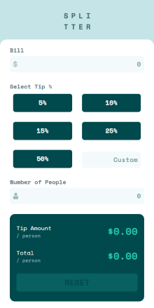

# 💡 Tip Calculator App

A responsive and user-friendly Tip Calculator App built with React.js and Tailwind CSS. Built as part of a [Frontend Mentor](https://www.frontendmentor.io) challenge to improve my frontend development skills.

---

## 🚀 Live Demo

👉 [Click here to view the live demo](https://utheshni.github.io/tip-calculator-app/)

---

## 🛠️ Built With

- **React.js** – JavaScript library for building interactive user interfaces
- **JavaScript (ES6+)** – programming language used with modern syntax and features
- **Vite** – build tool for faster development and bundling
- **Tailwind CSS** – utility-first CSS framework for styling

---

## 📸 Screenshots



---

## ✅ Features

- Real-time calculations — Tip and total per person update instantly.
- Preset tip percentages (5%, 10%, 15%, 25%, 50%)
- Custom tip percentage input
- Input validation — Prevents invalid numbers, negative values, and excessive decimal places
- Responsive Design for all screen sizes
- Reset Button to clear all inputs

---

## 🧠 What I Learned

- How to use React state hooks (useState) for dynamic updates.
- Implementing input validation for better UX and preventing invalid data.
- Creating responsive layouts with Tailwind CSS.
- Managing component-based architecture in React.
- Writing cleaner, reusable code with props and functional components.

---

## 📦 Getting Started

To run the project locally:

```bash
# Clone the repository
git clone https://github.com/utheshni/tip-calculator-app.git

# Navigate into the folder
cd tip-calculator-app

# Install dependencies
npm install

# Start the development server
npm run dev
```

---

## 🙋‍♀️ About Me

I’m a recent graduate and frontend developer fresher passionate about building real-world projects. This portfolio project showcases my skills in React.js, Tailwind CSS, and modern web development as I continue improving my UI and React expertise.
Connect with me on [LinkedIn](https://linkedin.com/in/utheshni-uthayananth) or check out more of my work on [GitHub](https://github.com/utheshni).

---

## ⭐ Support

If you found this project helpful or like it, please consider giving it a ⭐ on [GitHub](https://github.com/utheshni/tip-calculator-app)!  
It encourages me to keep building and sharing more projects.

---

## 🙏 Acknowledgments

- This project was created based on the [Frontend Mentor](https://www.frontendmentor.io) challenge: [Tip Calculator App](https://www.frontendmentor.io/challenges/tip-calculator-app-ugJNGbJUX). 

---

## 📄 License

This project is licensed under the [MIT License](LICENSE). It allows users to quickly calculate the tip amount and the total bill per person, making bill splitting easy and hassle-free.